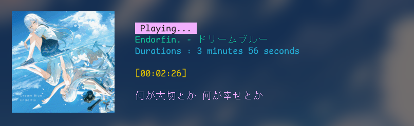

# Lyrica



An audio player + metadata viewer + lyrics previewer (provided you have the .lrc file)

## Dependencies
- Ncurses (soon)
- GStreamer
- Taglib
- Sixel

## Note
For image preview, you **need to have** terminal that support **sixel**

## Compiling
```
make
./lyrica
```